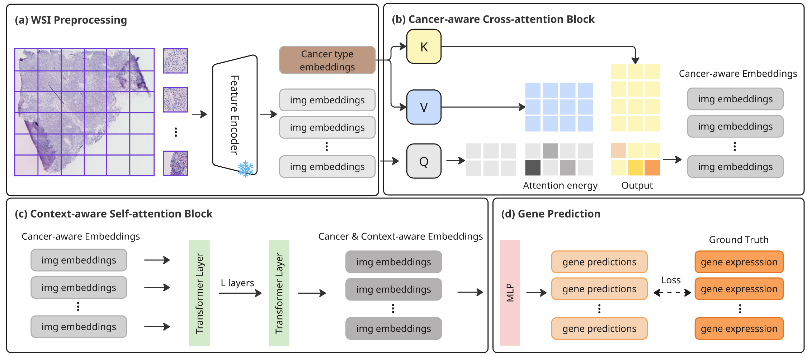
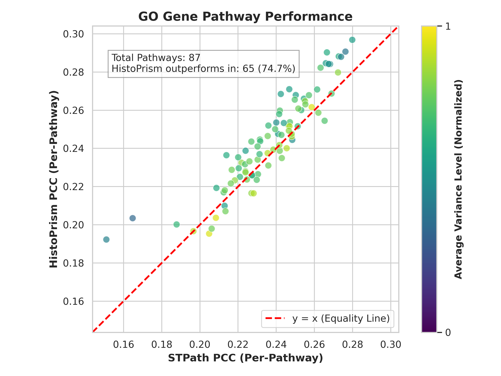
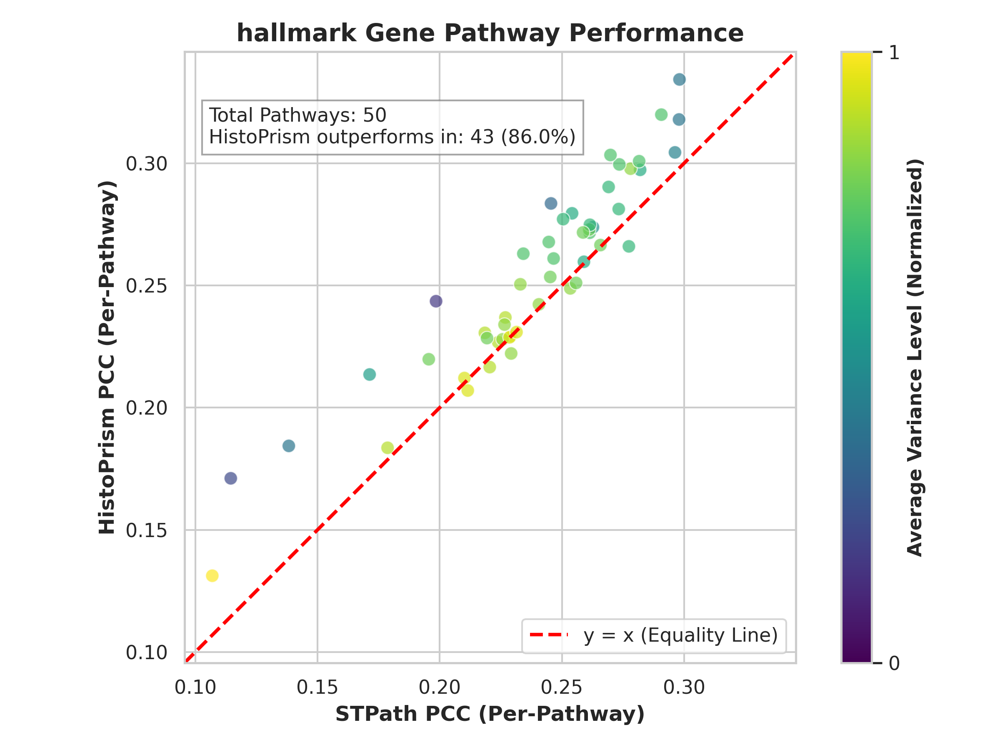
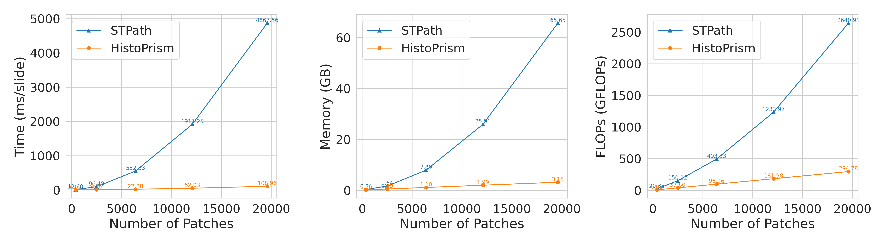

## HistoPrism: Unlocking Functional Pathway Analysis from Pan-Cancer Histology via Gene Expression Prediction

HistoPrism is an efficient transformer architecture that predicts spatial gene expression profiles directly from H&E histology slides. It addresses key limitations in prior work regarding generalizability and biological evaluation.

- **Unified Pan-Cancer Architecture**: Unlike prior per-cancer approaches or computationally heavy generative baselines, we introduce a unified, *lightweight model* that generalizes across diverse tissue types. This efficiency democratizes access, enabling resource-constrained institutes to fine-tune on small datasets and scale inference without massive infrastructure.

- **Gene Pathway Coherence (GPC) Benchmark**: We move beyond standard High-Variance Gene (HVG) metrics, which neglect biologically critical low-variance genes due to skewed distributions. We propose GPC, a novel framework that evaluates performance on functional biological pathways, demonstrating that our model recovers coherent, clinically relevant transcriptomic patterns across the full gene spectrum.




## Performance

HistoPrism achieves competitive performance on standard High-Variance Gene (HVG) metrics while demonstrating superior capability in recovering biologically meaningful signals. As shown below, our model outperforms baselines on the **Gene Pathway Coherence (GPC)** benchmark, successfully recovering coherent transcriptomic patterns across both GO terms and Hallmark pathways.

<p align="center">
  
   
</p>

In addition to biological accuracy, HistoPrism is designed for **computational efficiency**. It delivers state-of-the-art results with significantly lower resource requirements than generative baselines, enabling resource-constrained private institutes to fine-tune on a small ST dataset and scale inference to larger cohorts.

<p align="center">
  
</p>


##  TODOs

- update trainding code


## Quick Start
### Data Preprocessing

- Download HEST1k from huggingface https://huggingface.co/datasets/MahmoodLab/hest
- our preprocessed data with [uni](https://github.com/mahmoodlab/UNI) is in `data/processed_data/uni` with names `[sample_id]_embeddings.pt` which contains barcodes and correspongding uni features.
- data split is provided in `data/data_split_0`

Following code could be used to preprocecss HEST1k dataset.

```
python3 utils/pfm_preprocesing.py
```

### Training
```
python3 train.py -f configs/training_config_regressor.yml
```

### Inference
All gene inference, HVG PCC, GPC PCC

```
python3 inference.py -l [PATH/TO/YOUR/TRAINING/LOG/DIR]
```

## License

This project is licensed under the **Creative Commons Attribution-NonCommercial 4.0 International License (CC BY-NC 4.0)**. For full details, see the [LICENSE](LICENSE) file.

## Citation

If you find **HistoPrism** or our **Gene Pathway Coherence (GPC)** benchmark useful in your research, please consider citing our paper:

```bibtex
@inproceedings{Hu2026HistoPrism,
  title={{HistoPrism}: Unlocking Functional Pathway Analysis from Pan-Cancer Histology via Gene Expression Prediction},
  author={Hu, Susu and Zeng, Qinghe and Bhasker, Nithya and Kather, Jakob Nicholas and Speidel, Stefanie},
  booktitle={The Fourteenth International Conference on Learning Representations (ICLR)},
  year={2026},
  url={https://github.com/susuhu/HistoPrism}
}